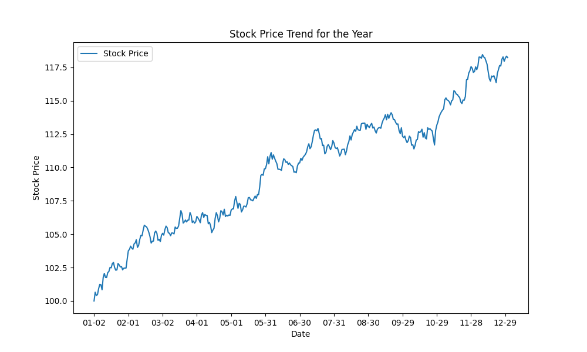
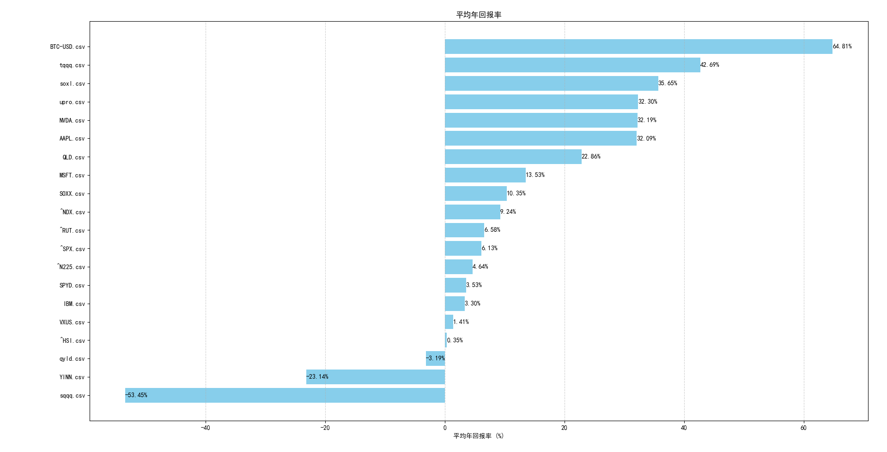

### tqqq_simulation ###

进行美股的各种小统计的脚本

* simple_py：运用numpy做点小统计  
* futu-news-crawler：新闻合订本  

* data: 从yahoo finance下载的公开数据
* old_tool: 回测qqq和其他etf的change ratio  

                                                                                                                                     
| 文件名                                | 描述                                       |
|-------------------------------------|------------------------------------------|
| `n_days_after_ATH.py`               | 可视化历史新高后N天的表现                       |
| `average_daily_change.py`           | 可视化的一年的平均走势                          |
| `visualize_ATH.py`                  | 可视化历史新高的天数                           |
| `visualize_ATH_spx.py`              | 可视化S&P 500的历史新高天数                   |
| `visualize_middle_east_war_2.py`    | 可视化中东战争时的走势                             |
| `visualize_std.py`                  | 可视化标准差                                |
| `visualize_year_change.py`          | 可视化年度变化                              |
| `simple_statistic_for_each_month.py`| 每月统计                                 |
| `statistic_by_month.py`             | 月份统计                                 |
| `statistic_specific_month.py`       | 特定月份统计                              |

| 文件名                                    | 描述                                     |
|-----------------------------------------|----------------------------------------|
| `compare_qqq_with_bitcoin_monthly.py`   | 比较QQQ与比特币的月度表现                   |
| `compare_qqq_with_bitcoin_return.py`    | 比较QQQ与比特币的回报                       |
| `compare_qqq_with_upro.py`              | 比较QQQ与UPRO                            |
| `compare_qqq_with_spy.py`               | 比较QQQ与SPY                             |

| 文件名                                 | 描述                                     |
|--------------------------------------|----------------------------------------|
| `CAGR.py`                            | 计算平均年化收益率                          |
| `dynamic_rebalance_backtest.py`      | 回测策略                                  |
| `find_good_uptrend.py`               | 寻找良好的上升趋势                         |
| `first_5_days_indicator.py`          | 看一年前五天和全年的相关性                    |
| `first_last_week.py`                 | 观察年的第一周和最后一周的表现               |
| `most_dramatic_day.py`               | 最波动的日子                               |
| `quiet_days.py`                      | 几乎不波动的日子                           |
| `random_performance.py`              | 分析随机表现                              |
| `strong_beginning_of_the_year.py`    | 统计年初几个月和全年表现得关系               |
| `strong_trend_40_days.py`            | 观察40天的强势趋势                         |

| 文件名                          | 描述                                    |
|-------------------------------|---------------------------------------|
| `yfinance_download.py`        | 从yahoo finance批量下载数据             |
