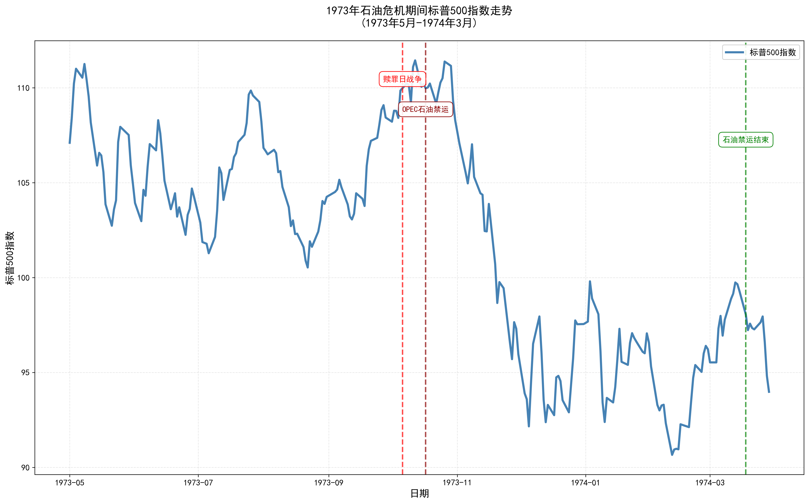

# 1973年石油危机对标普500的影响分析

## 一、概述

1973年第一次石油危机是20世纪最重要的经济事件之一。本报告分析了1973年10月至1974年3月石油禁运期间，原油价格暴涨对美国股市的影响。

## 二、数据可视化

*图：1973年5月-1974年3月标普500指数走势，标注了关键历史事件*

## 三、核心数据

### 原油价格变化
- **1973年5月**：$3.56/桶
- **1973年10月**（禁运前）：$4.31/桶
- **1974年1月**：$10.11/桶
- **涨幅**：从禁运前到1974年初上涨**134.6%**，接近**3倍**
- **整体涨幅**（1973年初到1974年）：原油价格从约$3涨到$12，**上涨约4倍**

### 标普500指数变化
- **1973年5月**：107.10点
- **1973年10月**（禁运前）：109.85点
- **1974年3月**（禁运结束）：93.98点
- **跌幅**：禁运期间下跌**14.4%**
- **整体跌幅**（5月-3月）：**12.3%**

### 禁运时长
- **开始**：1973年10月17日（OPEC宣布石油禁运）
- **结束**：1974年3月18日
- **持续时间**：约**5个月**

## 四、历史背景

### 赎罪日战争与石油武器化
1973年10月6日，埃及和叙利亚对以色列发动突然袭击，引发第四次中东战争（赎罪日战争）。10月17日，阿拉伯石油输出国组织（OAPEC）宣布对支持以色列的西方国家实施石油禁运，将石油作为政治武器。

### 油价暴涨的影响
原油价格在短短几个月内从每桶约$3暴涨至$12，涨幅达到**4倍**。这导致：
- 全球能源成本急剧上升
- 通货膨胀加剧
- 经济增长放缓
- 股市大幅下跌

## 五、为什么石油出口国无法长期禁运？

### 1. 经济依赖性
**石油出口国高度依赖石油收入维持国家运转：**
- 石油收入是这些国家的主要外汇来源
- 用于进口食品、药品、工业品等必需品
- 维持政府开支和社会福利
- 支付国防和基础设施建设

**长期禁运等于自我窒息**：石油出口国如果长期不卖油，就无法获得外汇购买必需品，经济会迅速崩溃。

### 2. 1973年禁运的教训
1973年的石油禁运仅持续了**5个月**就结束，原因包括：
- 阿拉伯国家自身经济压力巨大
- 西方国家开始寻找替代能源和供应商
- 禁运效果递减，反而损害自身利益
- 政治目标部分达成后，继续禁运得不偿失

### 3. 2026年的伊朗案例
**伊朗同样无法长期自我禁运：**

#### 经济现实
- 伊朗经济严重依赖石油出口（占出口收入的70-80%）
- 需要外汇购买：
  - 食品和药品
  - 工业设备和零部件
  - 技术和服务
  - 消费品

#### 制裁的影响
- 即使在西方制裁下，伊朗仍在想方设法出口石油
- 通过灰色市场、第三方转运等方式维持出口
- 证明了石油出口对伊朗的生存至关重要

#### 自我禁运的不可行性
**"不可能自己把自己掐死"**：
- 停止石油出口 = 切断外汇来源
- 无法进口必需品 = 经济崩溃
- 社会动荡 = 政权不稳
- 因此，任何理性的石油出口国都不会长期自我禁运

### 4. 全球化的制约
现代全球经济高度互联：
- 石油出口国需要全球市场
- 买家有多元化选择
- 长期禁运会永久失去市场份额
- 其他产油国会填补空缺

## 六、结论

### 短期影响
1973年石油危机对股市造成了显著的短期冲击，标普500在禁运期间下跌约14%。油价暴涨4倍引发了全球性的经济衰退和通货膨胀。

### 长期启示
1. **石油武器的局限性**：石油禁运是一把双刃剑，伤害对手的同时也严重损害自身经济
2. **经济相互依赖**：石油出口国无法长期脱离全球市场，必须持续出口以维持经济运转
3. **市场调节机制**：高油价会刺激替代能源开发和能源效率提升，削弱禁运效果
4. **政治工具的代价**：将石油政治化的代价高昂，难以持续

### 对当前的启示
2026年的地缘政治环境中，任何石油出口国（包括伊朗）都面临同样的经济约束：**需要外汇购买必需品，不可能长期自我禁运**。这是经济规律，不以政治意志为转移。

---

*数据来源：FRED（美联储经济数据库）、Yahoo Finance*  
*分析时间：2026年3月9日*
